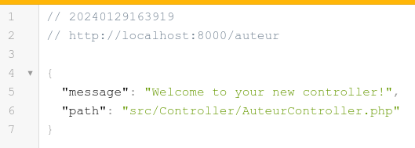
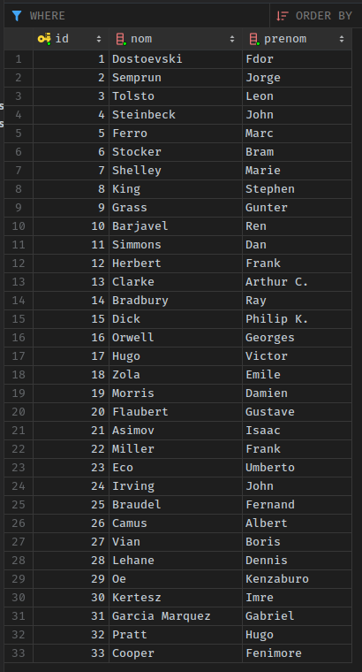
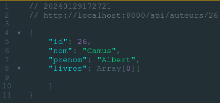
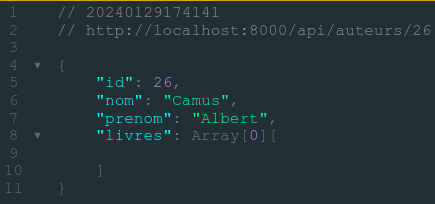

**IUT La Rochelle**
**Dev api**
**Kevin Simon**
___
## Developpement API
## Developpement avec le framework Symfony
___
## Application Symfony `sfapi`
## Api de l'entité `Auteur`
__

## Vérification utilisateur stack :

Dans un terminal :

- `docker compose exec sfapi bash` ouvre un termnal dans le conteneur *sfapi*
- `cd /app/sfapi`
- `ls -l`
- la propriétaire est root ?

Si le propiétaire est root :
- sudo groupadd docker
- sudo usermod -aG docker $USER
- newgrp docker

Dans un nouveau terminal dans le repertoire de la stack:
- sudo systemctl stop docker
- sudo chown -Rf votreuser:votregroupe *
- il y a un .env dans la stack
- modifier le contenu : 
    ```bash
    # fichier sfapi/.env
    # pour connaitre le groupe et l'utilisateur voir la commande id :
    # uid=1000(tinsuki) gid=1000(tinsuki) groupes=1000(tinsuki),4(adm)...
    USER_NAME=tinsuki  # votre nom d'utilisatieur
    USER_ID=1000       # votre id d'utilisateur
    GROUP_NAME=tinsuki # votre nom de groupe
    GROUP_ID=1000      # votre id de groupe
    ```
- sudo systemctl start docker
- docker compose up --build [-d]

## Objetifs :

- Comprendre et maitriser le routage Symfony
- Mettre en oeuvre le routage pour l'entit" `Auteur`
- Get (*), GET (1) (select)
- POST (insert)
- DELETE (delete)

#### Branche : 

On vérifie les branches : 
```bash
git branch
```

On créer la  branche 
```bash
git checkoout -b etape03-1
```


## Création du controlleur

Positionnement dans le conteneur `sfapi`
`docker compose exec sfapi bash`
`cd /app/sfapi`

`composer install`

Création du controlleur
`php bin/console make:controller AuteurController --no-templae`

Résultat
```bash
tinsuki@02080ba1a618:/app/sfapi$ php bin/console make:controller AuteurController --no-template
 created: src/Controller/AuteurController.php

           
  Success! 
           

 Next: Open your new controller class and add some pages!
 ```

 Le controlleur `AuteurController` définit par défaut la route `/auteur`

 


 ## Jeu de test pour les auteurs:

 - connecter la base de données `dbsfapi` dans phpstorm 
 - Ajouter des auteur à la base de données
 - On peut utiliser le fichier `auteur_insert.sql` qui se trouve sur moodle
 - __Attention__ : ne pas créer les livres
 
 - ouvrir une query console dans php sur la base de données (menu > new > query console)
 - copier le contenu du fichier
 - tout sélectionner
 - appuyer sur le bouton executer (flèche verte) en haut à gauche

 - double cliquer sur la table autauer dans l'onglet base de données pour voir les données

 


 ## On pouse l'étape03-1

On suppose qu'on est dans la branche etape02-1
```bash
git add .
git commit -m "etape03-1 : ctrl auteur et data"
git push --set-upstream-origin etape03-1
```

## route get all auteurs


dans le controlleur AuteurController

```php symfony
    #[Route('/api/auteurs', name: 'api_auteur', methods: ['GET'])]
    public function getAuteurs(AuteurRepository $auteurRepository): Response
    {
        $auteurs = $auteurRepository->findAll();
        return new JsonResponse($auteurs, 200, [], true);
    }
```
On test: 
`http://localhost:8000/api/auteurs`

Il y a une erreur :

```php
"Symfony\Component\HttpFoundation\JsonResponse::__construct": If $json is set to true, argument $data must be a string or object implementing __toString(), "array" given.
```

Les données de $auteurs ne sont pas sérializées donc ne sont pas envoyée sous la forme de json

On installe la serialisation

`composer require serializer

Route `/api/auteurs` :

```php
use Symfony\Component\Serializer\SerializerInterface;

    #[Route('/api/auteurs', name: 'api_auteur', methods: ['GET'])]
    public function getAuteurs(AuteurRepository $auteurRepository, SerializerInterface $serializer): Response
    {
        $auteurs = $auteurRepository->findAll();
        $auteursJson = $serializer->serialize($auteurs, 'json');
        return new JsonResponse($auteursJson, 200, [], true);
    }
```

test :
```json
// 20240129171640
// http://localhost:8000/api/auteurs

Array[33][
    {
        "id": 1,
        "nom": "Dostoevski",
        "prenom": "Fdor",
        "livres": Array[0][
            
        ]
    },
    {
        "id": 2,
        "nom": "Semprun",
        "prenom": "Jorge",
        "livres": Array[0][
            
        ]
    },
    {
        "id": 3,
        "nom": "Tolsto",
        "prenom": "Leon",
        "livres": Array[0][
            
        ]
    },
    {
        "id": 4,
        "nom": "Steinbeck",
        "prenom": "John",
        "livres": Array[0][
            
        ]
    },
    {
        "id": 5,
        "nom": "Ferro",
        "prenom": "Marc",
        "livres": Array[0][
            
        ]
    },
    {
        "id": 6,
        "nom": "Stocker",
        "prenom": "Bram",
        "livres": Array[0][
            
        ]
    },
    {
        "id": 7,
        "nom": "Shelley",
        "prenom": "Marie",
        "livres": Array[0][
            
        ]
    },
    {
        "id": 8,
        "nom": "King",
        "prenom": "Stephen",
        "livres": Array[0][
            
        ]
    },
    {
        "id": 9,
        "nom": "Grass",
        "prenom": "Gunter",
        "livres": Array[0][
            
        ]
    },
    {
        "id": 10,
        "nom": "Barjavel",
        "prenom": "Ren",
        "livres": Array[0][
            
        ]
    },
    {
        "id": 11,
        "nom": "Simmons",
        "prenom": "Dan",
        "livres": Array[0][
            
        ]
    },
    {
        "id": 12,
        "nom": "Herbert",
        "prenom": "Frank",
        "livres": Array[0][
            
        ]
    },
    {
        "id": 13,
        "nom": "Clarke",
        "prenom": "Arthur C.",
        "livres": Array[0][
            
        ]
    },
    {
        "id": 14,
        "nom": "Bradbury",
        "prenom": "Ray",
        "livres": Array[0][
            
        ]
    },
    {
        "id": 15,
        "nom": "Dick",
        "prenom": "Philip K.",
        "livres": Array[0][
            
        ]
    },
    {
        "id": 16,
        "nom": "Orwell",
        "prenom": "Georges",
        "livres": Array[0][
            
        ]
    },
    {
        "id": 17,
        "nom": "Hugo",
        "prenom": "Victor",
        "livres": Array[0][
            
        ]
    },
    {
        "id": 18,
        "nom": "Zola",
        "prenom": "Emile",
        "livres": Array[0][
            
        ]
    },
    {
        "id": 19,
        "nom": "Morris",
        "prenom": "Damien",
        "livres": Array[0][
            
        ]
    },
    {
        "id": 20,
        "nom": "Flaubert",
        "prenom": "Gustave",
        "livres": Array[0][
            
        ]
    },
    {
        "id": 21,
        "nom": "Asimov",
        "prenom": "Isaac",
        "livres": Array[0][
            
        ]
    },
    {
        "id": 22,
        "nom": "Miller",
        "prenom": "Frank",
        "livres": Array[0][
            
        ]
    },
    {
        "id": 23,
        "nom": "Eco",
        "prenom": "Umberto",
        "livres": Array[0][
            
        ]
    },
    {
        "id": 24,
        "nom": "Irving",
        "prenom": "John",
        "livres": Array[0][
            
        ]
    },
    {
        "id": 25,
        "nom": "Braudel",
        "prenom": "Fernand",
        "livres": Array[0][
            
        ]
    },
    {
        "id": 26,
        "nom": "Camus",
        "prenom": "Albert",
        "livres": Array[0][
            
        ]
    },
    {
        "id": 27,
        "nom": "Vian",
        "prenom": "Boris",
        "livres": Array[0][
            
        ]
    },
    {
        "id": 28,
        "nom": "Lehane",
        "prenom": "Dennis",
        "livres": Array[0][
            
        ]
    },
    {
        "id": 29,
        "nom": "Oe",
        "prenom": "Kenzaburo",
        "livres": Array[0][
            
        ]
    },
    {
        "id": 30,
        "nom": "Kertesz",
        "prenom": "Imre",
        "livres": Array[0][
            
        ]
    },
    {
        "id": 31,
        "nom": "Garcia Marquez",
        "prenom": "Gabriel",
        "livres": Array[0][
            
        ]
    },
    {
        "id": 32,
        "nom": "Pratt",
        "prenom": "Hugo",
        "livres": Array[0][
            
        ]
    },
    {
        "id": 33,
        "nom": "Cooper",
        "prenom": "Fenimore",
        "livres": Array[0][
            
        ]
    }
]
```

## Route obtenir un auteur :

#### Version 1

```php
    #[Route('/api/auteurs/{id}', name: 'api_auteur', methods: ['GET'])]
    public function getAuteur(Request $request, AuteurRepository $auteurRepository, SerializerInterface $serializer) : Response
    {
        $auteur = $auteurRepository->findOneBy(array('id' => $request->get('id')));
        $auteurJson = $serializer->serialize($auteur, 'json');
        return new JsonResponse($auteurJson, 200, [], true);
    }
```

test :



#### Version 2 

```php
    #[Route('/api/auteurs/{id}', name: 'api_auteur', methods: ['GET'])]
    public function getAuteur(Auteur $auteur, Request $request, AuteurRepository $auteurRepository, SerializerInterface $serializer) : Response
    {
        $auteurJson = $serializer->serialize($auteur, 'json');
        return new JsonResponse($auteurJson, 200, [], true);
    }
```




## Route POST /api/auteurs

```php
    // dans le controlleur :
    #[Route('/api/auteurs/', name: 'api_post_auteur', methods: ['POST'])]
    public function postAuteur(Request $request, AuteurRepository $auteurRepository, SerializerInterface $serializer) : Response
    {
        $data = $request->getContent();
        $auteur = $serializer->deserialize($data, Auteur::class, 'json');
        $auteurRepository->add($auteur, true);
        return new JsonResponse("", Response::HTTP_CREATED, [], true);
    }

    // dans le repository :
    public function add(Auteur $entity, bool $flush = false): void{
        $this->getEntityManager()->persist($entity);

        if ($flush){
            $this->getEntityManager()->flush();
        }
    }
```


## Bilan :

- création de controlleur pour api en symfony
- création de route pour api en symfony
- récupération d'entitées depuis la base de données