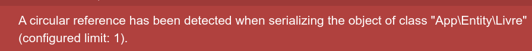
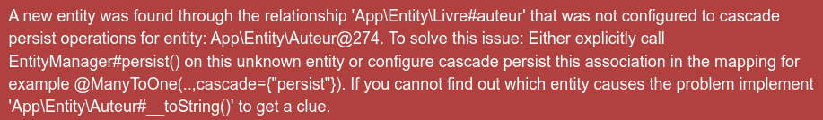

## DevApi
## Application sfapi
## Entité Livre

## créer ka branche `etape03-2`

on se positione à la racine du projet 

on vérifie qu'on est sur la branche `etape03-1

on créer la branche 

on vérifie 

## jeu de test pour les livres

- Connecter la BD `dbsfapi` dans phpstorm

- Ajouter des auteurs, si ce n'est pas fait à l'étape03-1

- Ajouter des livres à la base de données

- On utilise les fichiers `auteur_insert.sdl` et `livre_insert.sql` qui se trouvent sur moodle

## Controleur `LivreController

- creation du controleur 

```bash
php bin/console make:controller LivreController --no-template
```

### Route `/api/livres`, méthode=GET

```php
    #[Route('/api/livres', name: 'api_livres', methods: ['GET'])]
    public function getLivres(LivreRepository $livreRepository, SerializerInterface $serializer) : Response
    {
        $livres = $livreRepository->findAll();
        $livresJson = $serializer->serialize($livres, 'json');
        return new JsonResponse($livresJson, 200, [], true);
    }
```

=> erreur de référence circulaire :


### ajout de l'annotation @Groups

#### Règle de lecture de k'opération GET(*) sur `Livre`

1 - L'opération GET(*) sur l'entité  Livre : lit tous les attributs de l'entité Livre
2 - L'opération GET(*) sur l'entité Auteur : lit les attributs id, nom, prenom de l'entité Auteur

##### Implémentation de la règle

```php
use Symfony\Component\Serializer\Annotation\Groups;

#[ORM\Entity(repositoryClass: LivreRepository::class)]
class Livre
{
    #[ORM\Id]
    #[ORM\GeneratedValue]
    #[ORM\Column]
    #[Groups('liste_livres')]
    private ?int $id = null;

    #[ORM\Column(length: 255)]
    #[Groups('liste_livres')]
    private ?string $titre = null;

    #[ORM\Column]
    #[Groups('liste_livres')]
    private ?int $annee = null;

    #[ORM\ManyToOne(inversedBy: 'livres')]
    #[Groups('liste_livres')]
    private ?Auteur $auteur = null;

    [...]

use Symfony\Component\Serializer\Annotation\Groups;

#[ORM\Entity(repositoryClass: AuteurRepository::class)]
class Auteur
{
    #[ORM\Id]
    #[ORM\GeneratedValue]
    #[ORM\Column]
    #[Groups('liste_livres')]
    private ?int $id = null;

    #[ORM\Column(length: 255)]
    #[Groups('liste_livres')]
    private ?string $nom = null;

    #[ORM\Column(length: 255)]
    #[Groups('liste_livres')]
    private ?string $prenom = null;

    #[ORM\OneToMany(mappedBy: 'auteur', targetEntity: Livre::class)]
    private Collection $livres;
```    

```php
    #[Route('/api/livres', name: 'api_livres', methods: ['GET'])]
    public function getLivres(LivreRepository $livreRepository, SerializerInterface $serializer) : Response
    {
        $livres = $livreRepository->findAll();
        $livresJson = $serializer->serialize($livres, 'json', ['groups' => ['liste_livres']]);
        return new JsonResponse($livresJson, 200, [], true);
    }
```

- on test :
    ```url
    http://localhost:8000/api/auteurs
    ```
    -- Résulat ok

- on test :
    ```url
    http://localhost:8000/api/auteurs
    ```
    -- Erreur

### La route `/api/auteurs , méthode=GET, ajout de l'annotation @Groups

#### Règle de lecture de l'opération GET(*) sur Auteur

1 - L'opération GET(*) sur l'entité Auteur : lit tous les attributs de l'entité Auteur
2 - L'opération GET(*) sur l'entité Livre : lit les attributs id, titre, annee de l'entité Livre


#### Implémentation de la règle :

```php
    // Livre :
    #[ORM\Id]
    #[ORM\GeneratedValue]
    #[ORM\Column]
    #[Groups(['liste_livres', 'liste_auteurs'])]
    private ?int $id = null;

    #[ORM\Column(length: 255)]
    #[Groups(['liste_livres', 'liste_auteurs'])]
    private ?string $titre = null;

    #[ORM\Column]
    #[Groups(['liste_livres', 'liste_auteurs'])]
    private ?int $annee = null;

    #[ORM\ManyToOne(inversedBy: 'livres')]
    #[Groups('liste_livres')]
    private ?Auteur $auteur = null;

    [...]

    // Auteur :
    #[ORM\Id]
    #[ORM\GeneratedValue]
    #[ORM\Column]
    #[Groups(['liste_livres', 'liste_auteurs'])]
    private ?int $id = null;

    #[ORM\Column(length: 255)]
    #[Groups(['liste_livres', 'liste_auteurs'])]
    private ?string $nom = null;

    #[ORM\Column(length: 255)]
    #[Groups(['liste_livres', 'liste_auteurs'])]
    private ?string $prenom = null;

    #[ORM\OneToMany(mappedBy: 'auteur', targetEntity: Livre::class)]
    #[Groups('liste_auteurs')]
    private Collection $livres;

    // AuterController :
    #[Route('/api/auteurs', name: 'api_auteurs', methods: ['GET'])]
    public function getAuteurs(AuteurRepository $auteurRepository, SerializerInterface $serializer): Response
    {
        $auteurs = $auteurRepository->findAll();
        $auteursJson = $serializer->serialize($auteurs, 'json', ['groups' => 'liste_auteurs']);
        return new JsonResponse($auteursJson, 200, [], true);
    }
```

- on test :
    ```url
    http://localhost:8000/api/auteurs
    ```
    -- Résulat ok

- on test :
    ```url
    http://localhost:8000/api/auteurs
    ```
    -- Résultat ok

- on test :
    ```url
    http://localhost:8000/api/auteurs/1
    ```
    -- Erreur

### la route `/api/auteurs/{id}`, méthode = GET

```php
    #[Route('/api/auteurs/{id}', name: 'api_auteur', methods: ['GET'])]
    public function getAuteur(Auteur $auteur, Request $request, AuteurRepository $auteurRepository, SerializerInterface $serializer) : Response
    {
        $auteurJson = $serializer->serialize($auteur, 'json', ['groups' => 'liste_auteurs']);
        return new JsonResponse($auteurJson, 200, [], true);
    }
```

### la route `/api/livres/{id}`, méthode = GET

```php
    #[Route('/api/livres/{id}', name: 'api_livre', methods: ['GET'])]
    public function getLivre(Livre $livre, LivreRepository $livreRepository, SerializerInterface $serializer) : Response
    {
        $livresJson = $serializer->serialize($livre, 'json', ['groups' => ['liste_livres']]);
        return new JsonResponse($livresJson, 200, [], true);
    }
```

### la route `/api/livres`, méthode = POST

#### Règle d'écriture de l'opération POST sur `Livre`

```
On souhaite inséerer un livre pour un auteur existant
```

### Implementation : approche simple

```php
    #[Route('/api/livres', name: 'api_post_livres', methods: ['POST'])]
    public function postLivre(Request $request, LivreRepository $livreRepository, AuteurRepository $auteurRepository, SerializerInterface $serializer) : Response
    {
        $data = $request->toArray();
        $livre = new Livre();
        $livre->setTitre($data['titre']);
        $livre->setAnnee(($data['annee']));

        $auteur = $auteurRepository->find($data['auteur']['id']);

        $livre->setAuteur($auteur);
        $livreRepository->add($livre, true);
        return new JsonResponse('', Response::HTTP_CREATED, [], true);
    }
```

```php
    public function add (Livre $entity, bool $flush = false) : void
    {
        $this->getEntityManager()->persist($entity);

        if ($flush){
            $this->getEntityManager()->flush();
        }
    }
```

- Conclusion : il nous manque necore du code pour de la validation

#### Règle d'écriture de l'opération POST sur `Livre`

```
on souhaite créer un livre et son auteur
```

#### Implémentaion : approche de persistence en cascade

```php
    #[Route('/api/livres', name: 'api_post_livres', methods: ['POST'])]
    public function postLivre(Request $request, LivreRepository $livreRepository, AuteurRepository $auteurRepository, SerializerInterface $serializer) : Response
    {
        $data = $request->getContent();
        $livre = $serializer->deserialize($data, Livre::class, 'json');
        $livreRepository->add($livre, true);
        return new JsonResponse('', Response::HTTP_CREATED, [], true);
    }
```



```En français :
Une nouvekke entité a été trouvée via la relation 'App\Entity\Livre#auteur' qui n'a pas été configuré pour
effectuer des opérations de persitence en cascade pour l'entité : App\Entity\Auteur@274

Pour résoudre ce problème :
- soit vous appeler explicitement
```


La fonction post fonctionne bien (elle ajoute le livre et l'auteur)  mais il duplique les auteurs mâme si on précise l'id `id`

### Conclusion 
Pour avoir une opération de POST complète il faut faire la fusion des deux cas. plus, un système de validation efficace !!
Ce n'est pas notre objectif actuellement.

### Route /api/livre/{id} methode = DELETE

```php
    public function deleteLivre(Livre $livre,  LivreRepository $repository) : Response
    {
        $repository->remove($livre, true);
        return new JsonResponse("", Response::HTTP_OK, [], true);
    }


    public function remove(Livre $entity, bool $flush = false) : void
    {
        $this->getEntityManager()->remove($entity);

        if ($flush){
            $this->getEntityManager()->flush();
        }
    }
```

### On pousse l'etape03-2
```git
git add .
git commit -m "etap03-2 fin"
git push --set-upstream origin etape03-2
```

### BILAN

- Comprendre le routage Sf
    - l'annotation `#Route`
    - l'url de l'api
    - url et methode HTTP (GET, POST, DELETE, ...)
    - sérialisation des données
    - réponses http
    - ...

- Mettre en oeuvre le routage pour l'entité `Livre` et `Auteur`
    - mettre en oeuvre la notion de groupe pour gérer les relations, annotation `#Groups`

- Get (*), GET (1) (select)
    - les codes source des 2 routes dans kes 2 controlleurs : se ressemblent 
    - on peut même dire que c'est le mêle
- POST (insert)
    - le insert de `Livre` est différent de celui de `Auteur` car il faut deserialiser une entité avec ralation (qui contient une relation)
    - La route POST dans les 2 controlleur respecte le même fonctionnement
- DELETE (delete)
    - le code source des 2 routes dans les 2 controlleurs : se ressemblent 